# **Custom object detection tutorial**

해당 튜토리얼은 [tensorflow_object_detection_helper_tool](https://github.com/5taku/tensorflow_object_detection_helper_tool)을 활용해서 진행됩니다.  
미리 만들어진 dataset을 활용하는 Simpson Charactors Object Detection Tutorial은 [여기](https://github.com/5taku/simpson_charactors_object_detection)를 참고하시길 바라겠습니다.  

# Table of contents
1. [Summary](#summary)  
2. [Tutorial](#tutorial)  
    1) [STEP 1. 데이터 수집](#datacollecting)
    2) [STEP 2. 데이터 라벨링](#labeling)
    3) [STEP 3. TF RECORD 파일 생성](#maketfrecord)
    4) [STEP 4. label_map.pbtxt 파일 수정](#labelmapupdate)
    5) [STEP 5. Transfer Learning & exporting](#trainig)
    6) [STEP 6. Export model 확인](#exporting)
3. [Extra](#extra)    
    1) [Evaluate 값 확인](#evaluating)
    2) [Loss 값 확인](#loss)
    3) [Log 값 확인](#log)
    4) [Model별 Training Time 확인](#time)
     
     
## Summary 

Pretrain 되어서 제공되는 Model들은 대부분 [coco dataset](http://cocodataset.org/) 을 기본 dataset으로 training 되었습니다.
따라서 coco dataset instance 에 없는 데이터는 custom된 dataset 을 준비하여 transfer learning을 시켜야 합니다.

해당 튜토리얼은 Custom Object Detection 을 위한 data의 수집, labeling, training등을  
[tensorflow_object_detection_helper_tool](https://github.com/5taku/tensorflow_object_detection_helper_tool)을 활용하여 진행하는 방법에 대한 튜토리얼 입니다.  

## Tutorial  

해당 튜토리얼은 google cloud comute engine 에서 테스트 되었으며 vm의 사양은 다음과 같습니다.

    16 vCPU
    60gb Ram
    1 x NVIDIA Tesla P100
    ubuntu 16.0.4
    python 2.7.12
    tensorflow 1.8.0
    cuda 9.0
    cudnn 7.1
    
### STEP 1. 데이터 수집  

귀여운 판다, 라쿤, 수달, 포메라니안, 미어캣을 디텍팅해보겠습니다.    
각각의 이미지를 100장씩 준비합니다.

[Google image download](https://github.com/hardikvasa/google-images-download) 를 사용하여 이미지를 다운로드 합니다. ( 저작권을 조심하시길 바라겠습니다. )  

     googleimagesdownload --keywords "panda" --size medium --output_directory ./panda  
     
위의 명령어대로 실행하면, 이미지를 폴더에 다운로드 하게 됩니다.  
적당하게 잘못된 이미지를 지우고 다른 이미지로 채워 넣습니다.

raccoon , otter , pomeranian , meerkat 역시 동일하게 이미지를 준비합니다.

오직 jpg 파일포맷의 이미지만 가능합니다.

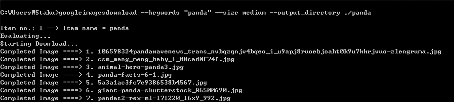  
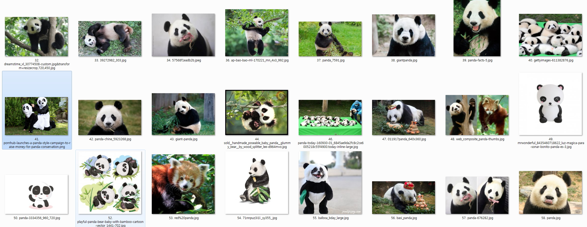  

### STEP 2. 데이터 라벨링 

[labelimg](https://github.com/tzutalin/labelImg) 를 사용하여 원본 이미지와 오브젝트 영역을 저장한 xml 을 하나의 폴더에 위치 시킵니다.  
( 기본 폴더는 images 폴더입니다.)  

하나의 이미지에 여러개의 라벨이 존재할 수 있습니다.  
Tip. 각각의 Object 에서 default label을 설정하면 라벨을 하나하나 입력할 필요가 없습니다.  
Tip. 단축키 W 는 영역지정 A 는 이전 이미지 D 는 다음 이미지 Ctrl + S 는 저장입니다.  

500장의 이미지를 라벨링하는데 50분 정도의 시간이 소요되었습니다.  

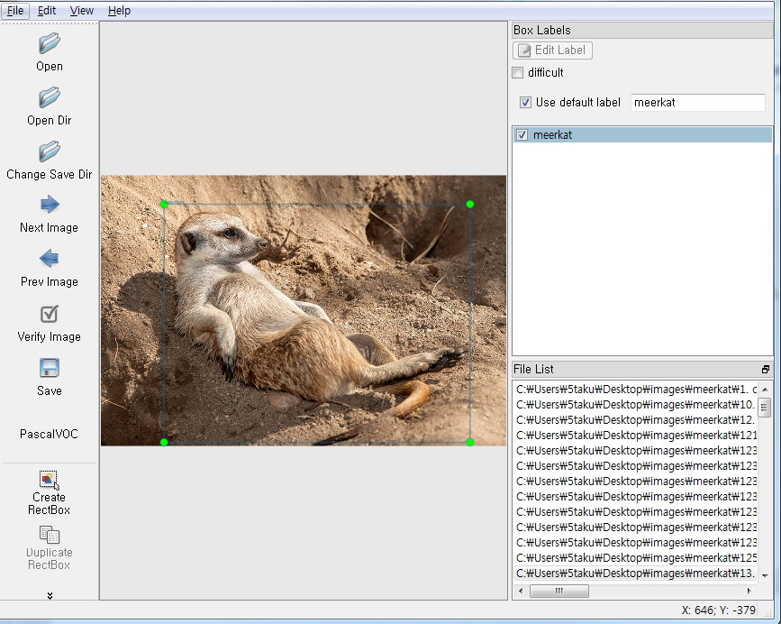  

### STEP 3. TF RECORD 파일 생성 

tfgenerator.py 명령어를 수행하여, TF RECORD 파일을 생성합니다.

    python tfgenerator.py    

process.log 파일을 통하여 요약정보를 확인할 수 있습니다.

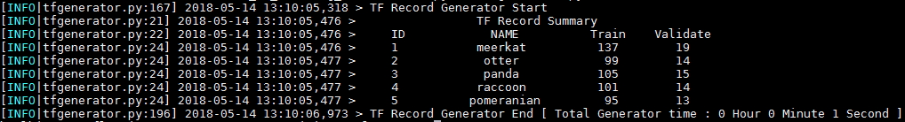  

train , validate 비율을 변경하려면, -sr 옵션을 사용하면 됩니다.

    python tfgenerator.py -sr 5
    
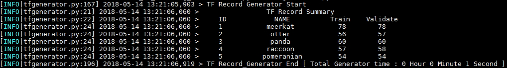      

위의 원본 이미지, xml, csv, record 파일은 [여기](https://drive.google.com/drive/folders/1WwqFT6sbgoL6n7Bq-qbcvwkVHNSztKVS?usp=sharing)에서 다운받으실 수 있습니다.  

### STEP 4. label_map.pbtxt 파일 수정 

레이블과 번호를 입력하여 줍니다.

    item {
      id: 1
      name: 'meerkat'
    }
    item {
      id: 2
      name: 'otter'
    }
    item {
      id: 3
      name: 'panda'
    }
    item {
      id: 4
      name: 'raccoon'
    }
    item {
      id: 5
      name: 'pomeranian'
    }

### STEP 5. Transfer Learning & exporting 

Faster_Rcnn_Inception_v2_coco 모델을 가지고 50,000번 training 시켜보겠습니다.  
3,000번마다 evaluate 값을 확인하겠습니다.

    python main.py -n 3000

 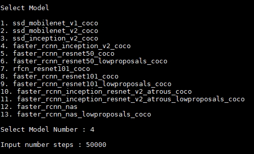     
 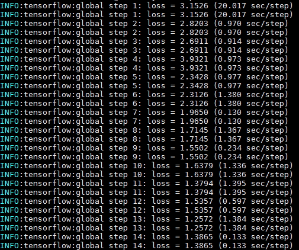     
 
 ### STEP 6. Export model 확인 
 
 export_dir 폴더로 이동합니다.
 
    ./export_dir/faster_rcnn_inception_v2_coco_2018_01_28 
 
 frozen_inference_graph.pb 파일이 존재하는지 확인합니다.
 
 ### 번외0. 테스트 이미지 확인
 
 테스트 이미지 폴더에 적절한 이미지들을 넣습니다.  
 기본 테스트 이미지 폴더는 아래와 같습니다.  
 (image0.jpg 부터 시작하여 번호를 증가시킵니다.)  
 
     ./object_detection/test_images
 
 jupyter notebook을 실행합니다.
 
 object detection 튜토리얼 파일을 수행합니다. 
 
     ./object_detection/object_detection_tutorial.ipynb
     
 결과값을 확인합니다.  
 
  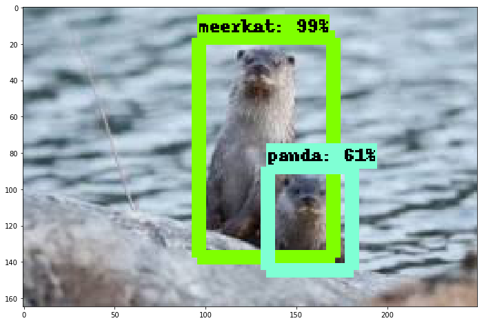   
  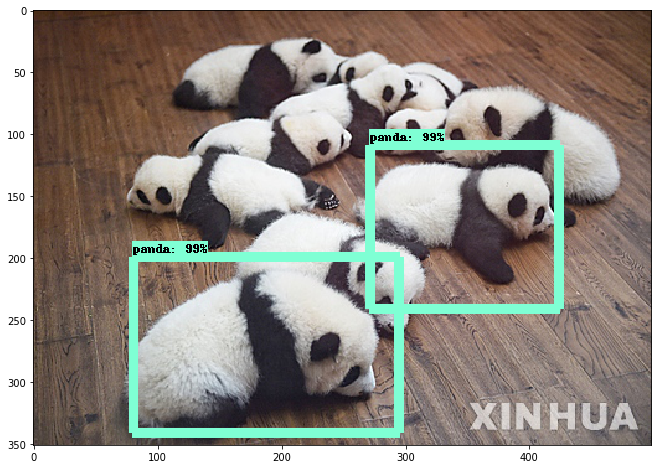   
  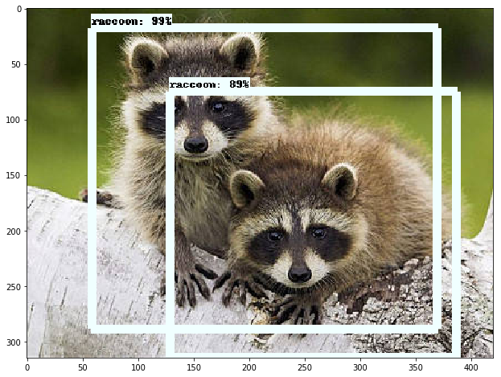   
  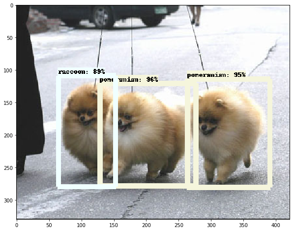   
  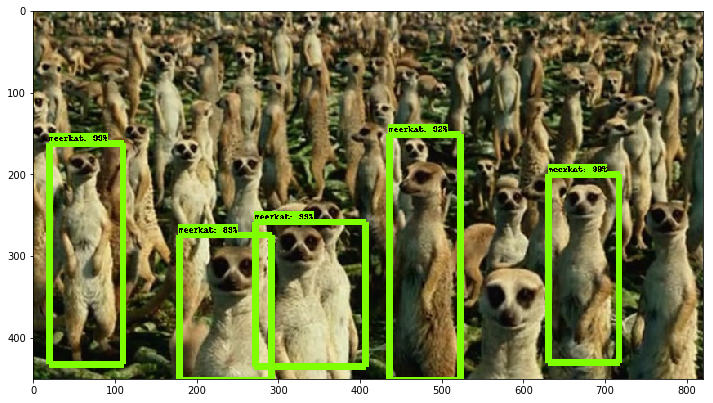         
 
 위의 결과를 보면, 정확한 결과값을 내지 못하는 경우도 있습니다.  
 이 경우, 모델의 변경, dataset 의 추가, training_step의 증가, hyperparameter 변경등을 통하여 정확도를 향상시킬 수 있습니다.  
 
 ## Extra
 
 ### Evaluate 값 확인 
 
 eval_dir 폴더로 이동합니다.
 
     ./eval_dir/faster_rcnn_inception_v2_coco_2018_01_28 
     
 tensorboard를 실행합니다.
 
     $tensorboard --logdir=./
     
 각 이미지들을 확인합니다.
 
  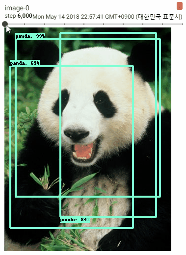      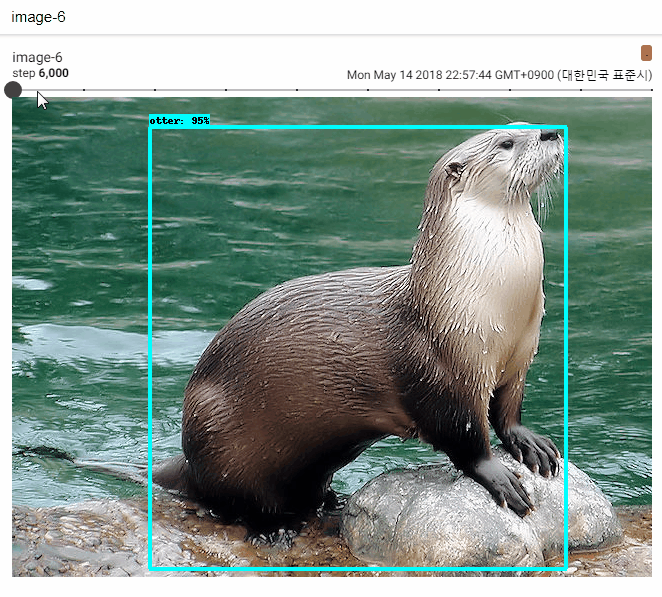     
 
 ### Loss 값 확인 
 
 train_dir 폴더로 이동합니다.   
 
     ./train_dir/faster_rcnn_inception_v2_coco_2018_01_28 
 
 tensorboard를 실행합니다.
 
     $tensorboard --logdir=./
    
  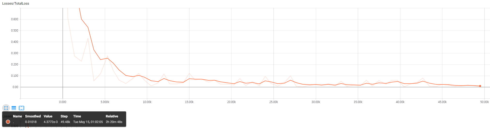 
  
  ### Log 값 확인 
  
  최상단의 process.log 파일을 확인하여 record 파일 생성 summary , training time , total process time 등을 확인할 수 있습니다.  
  
      ./cat process.log
  
  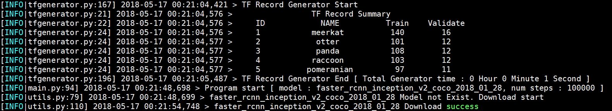 
  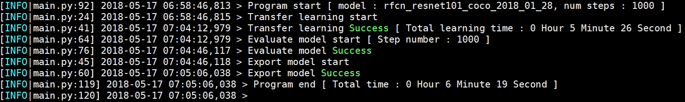 
   
  ### Model별 training time 확인 
  
  모델별, 1000 step, training -> evaluating -> exporting time 체크  
  
  테스팅 환경
    
    16 vCPU
    60gb Ram
    1 x NVIDIA Tesla P100
    ubuntu 16.0.4
    python 2.7.12
    tensorflow 1.8.0
    cuda 9.0
    cudnn 7.1
      
|                           Model                          | Size | Training time |
|:--------------------------------------------------------:|:----:|:-------------:|
| ssd_mobilenet_v1_coco                                    | 86M  | 9m 44s        |
| ssd_mobilenet_v2_coco                                    | 201M | 11m 12s       |
| ssd_inception_v2_coco                                    | 295M | 8m 43s        |
| faster_rcnn_inception_v2_coco                            | 167M | 4m 43s        |
| faster_rcnn_resnet50_coco                                | 405M | 4m 28s        |
| faster_rcnn_resnet50_lowproposals_coco                   | 405M | 4m 30s        |
| rfcn_resnet101_coco                                      | 685M | 6m 19s        |
| faster_rcnn_resnet101_coco                               | 624M | 6m 13s        |
| faster_rcnn_resnet101_lowproposals_coco                  | 624M | 6m 13s        |
| faster_rcnn_inception_resnet_v2_atrous_coco              | 712M | 18m 6s        |
| faster_rcnn_inception_resnet_v2_atrous_lowproposals_coco | 712M |               |
| faster_rcnn_nas                                          | 1.2G | 47m 49s       |
| faster_rcnn_nas_lowproposals_coco                        | 1.2G |               |

  
  